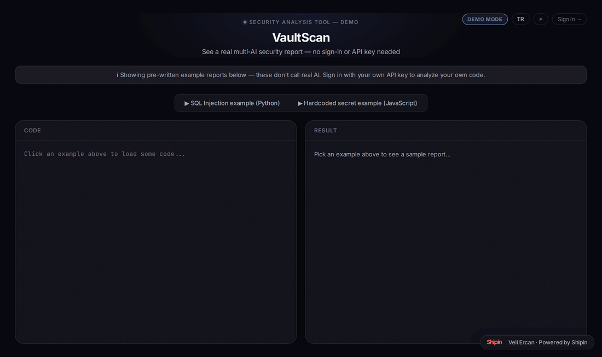

# VaultScan

[](https://github.com/chavooosss/VaultScan/actions/workflows/tests.yml)
[](https://vaultscan-pxyt.onrender.com)
[](LICENSE)
[](https://www.python.org/)

VaultScan is a tool that lets you point AI at your code and ask: "is there a security vulnerability here?" Paste a code snippet, upload a file/ZIP, or give it a GitHub repo link — VaultScan reads the code, flags risky spots (SQL injection, XSS, leaked secrets, weak validation, and more), and shows you a readable report.

**Live at: https://vaultscan-pxyt.onrender.com · [Try the no-login demo →](https://vaultscan-pxyt.onrender.com/demo)**



## What's the point?

Say you wrote something and you're wondering "should I get this checked for security issues?" but hiring a security consultant isn't really an option. VaultScan is built for exactly that: it shows your code (or your whole project) to AI and lists what it finds, each tagged with a severity (critical / high / medium / low).

**Why not just paste the code back into the same AI that wrote it, in a fresh chat?** You can, and it might catch some things — but a single model reviewing its own (or anyone's) code only gives you one opinion, with that one model's particular blind spots. VaultScan's actual point isn't "AI reads your code" — that part is table stakes. It's **running multiple independent models on the same code at once and merging what they find**: Claude, ChatGPT, and Gemini each review the code separately, with a security-specific prompt (not a generic "review my code" chat), and their findings get combined into one report that shows which model(s) caught each issue. A vulnerability one model misses, another often catches — and when all three agree, that's a much stronger signal than any single model's opinion.

## Features

- **No-login demo** — [`/demo`](https://vaultscan-pxyt.onrender.com/demo) lets anyone try the full UI and see real example reports with no sign-in or API key required.
- **Paste code** — drop in a snippet and analyze it directly.
- **Upload a file / ZIP** — single file or a ZIP with many files; VaultScan prioritizes the most security-relevant files first.
- **GitHub repo analysis** — give it a repo URL (public, or private with a token) and watch it scan file by file with live progress.
- **Multi-AI support** — choose between Claude (Anthropic), ChatGPT (OpenAI), and Gemini (Google).
- **Collaborative mode** — select more than one AI at once and their findings get merged into a single report, with each finding labeled by which model(s) caught it.
- **Bilingual UI (English/Turkish)** — a language toggle next to the theme toggle switches the entire interface, *and* the AI-generated analysis itself: ask in English, get an English report back; same for Turkish.
- **Sign in with Google** — required to use the app.
- **Bring your own API key (BYOK)** — VaultScan has no AI key of its own; each user adds their own Claude/ChatGPT/Gemini key from `/settings`, and that key is used for their analyses. Keys are stored encrypted, never shown back in plain text.
- **Export reports** — download as Markdown or print as PDF.
- **Analysis history** — `/history` shows past analyses' reports (never the underlying code/file/repo content); can be turned off anytime from `/settings`.

## How it works

1. Sign in with your Google account.
2. Add your own API key for whichever AI provider(s) you want to use, from `/settings` (Claude and ChatGPT keys are paid — you need billing/credits on that account; Gemini has a free tier).
3. Paste code, upload a file, or give it a GitHub repo.
4. Pick which AI(s) to run.
5. VaultScan sends the code to your chosen provider(s) — using your own key — and turns the response into a readable HTML report.
6. If you picked more than one AI, the results are automatically merged into a single combined report.

## Running it locally

```bash
git clone <repo-url>
cd VaultScan

python3 -m venv .venv
source .venv/bin/activate

pip install -r requirements.txt
```

Copy `.env.example` to `.env`:

```bash
cp .env.example .env
```

Fill in your own values:

| Variable | What it's for |
|---|---|
| `GOOGLE_CLIENT_ID` / `GOOGLE_CLIENT_SECRET` | Google sign-in (create an OAuth Client ID in Google Cloud Console) |
| `SESSION_SECRET` | Random string used to sign session cookies (e.g. `python -c "import secrets; print(secrets.token_hex(32))"`) |
| `ENCRYPTION_KEY` | Used to encrypt users' AI API keys at rest (e.g. `python -c "from cryptography.fernet import Fernet; print(Fernet.generate_key().decode())"`) |
| `DATABASE_URL` | Optional. Defaults to a local SQLite file (`sqlite:///vaultscan.db`) if unset; production runs on Postgres (Neon) |

VaultScan has no AI key of its own — each user enters their own Claude/ChatGPT/Gemini key from inside the app (`/settings`), so you don't need to add one to `.env`.

Start the server:

```bash
uvicorn main:app --reload
```

Open `http://localhost:8000` in your browser.

## Running the tests

```bash
pytest
```

Tests use their own isolated database file and never touch real data. CI runs the same suite on every push/PR via GitHub Actions (`.github/workflows/tests.yml`).

## Tech stack

- **Backend:** FastAPI (Python)
- **Database:** SQLAlchemy — Postgres (Neon) in production, SQLite for local dev
- **Auth:** Google OAuth (Authlib) + signed session cookies
- **AI providers:** Anthropic (Claude), OpenAI (ChatGPT), Google (Gemini)
- **Frontend:** Plain HTML/CSS/JavaScript (no framework, kept deliberately simple), with a small `i18n.js` module for the English/Turkish language toggle
- **CI:** GitHub Actions

## Project structure

```
VaultScan/
├── main.py              # FastAPI routes (analyze, upload, github, auth, API key management, etc.)
├── analyzer.py          # Single/multi-AI analysis flow, result-merging logic
├── db.py                # SQLAlchemy models (User, Analysis) and database helpers
├── auth.py              # Google OAuth client
├── config.py            # Reads environment variables / settings
├── prompts.py           # System prompts sent to the AIs (English + Turkish)
├── i18n.py              # Backend message catalog (English + Turkish), keyed off the X-Lang header
├── providers/           # One module per AI provider (claude/chatgpt/gemini)
├── static/              # Frontend (HTML/CSS/JS), including i18n.js and the /settings, /history pages
└── tests/               # pytest test suite
```

## Roadmap

VaultScan is under active development. Currently being worked on / planned:

- More UI polish


## License

All rights reserved — see [LICENSE](LICENSE). The source is public for transparency and portfolio purposes; reuse, redistribution, or commercial use requires written permission.

---

## Türkçe (kısa özet)

VaultScan, kodunu (veya bir GitHub reponu) yapay zekâya gösterip güvenlik açığı olup olmadığını sorduğun bir araç. Tek bir AI'a değil, istersen Claude, ChatGPT ve Gemini'ye aynı anda sorabilirsin — bulgular tek bir ortak raporda birleşir. Her kullanıcı kendi API key'ini ekler (BYOK), key'ler şifreli saklanır. Arayüz hem Türkçe hem İngilizce — sağ üstteki dil butonuyla değiştirebilirsin, AI'nın ürettiği rapor da seçtiğin dile göre gelir. Canlı adres: https://vaultscan-pxyt.onrender.com
